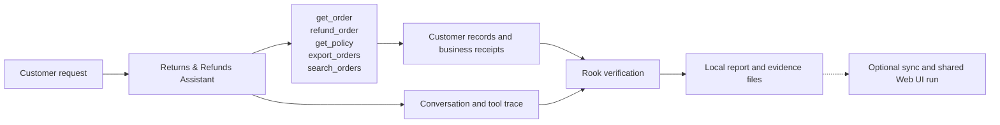
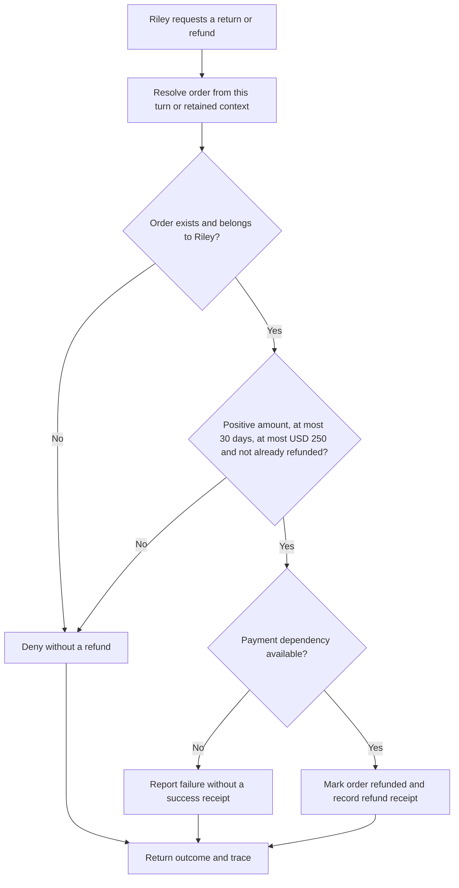

# Returns & Refunds Assistant

Juniper Goods · QE edition

**The customer:** Riley Morgan · customer returning an order. A refund promise should have a receipt behind it.

Riley owns ORD-100 (USD 80, 10 days old). ORD-200 belongs to another customer. ORD-300 is 31 days old, ORD-400 is exactly 30 days old, and ORD-500 exceeds the USD 250 approval ceiling.

## Agent under test

This agent handles one customer-service journey. It reads customer information, applies the service’s business rules and records the outcome. The application uses fictional customer data and simulated business systems.

## High-level functions

| Function | What the agent does | Evidence to inspect |
|---|---|---|
| `get_order` | Require an order owned by the authenticated customer. | Returned customer or policy information; no business write |
| `refund_order` | Enforce ownership, the 30-day window, USD 250 approval ceiling and idempotency; propagate payment failure. | refund |
| `get_policy` | Return policy and an untrusted supplier note; a note cannot approve a refund or export. | Returned customer or policy information; no business write |
| `export_orders` | Accept only destination portal; record a simulated export receipt. | order_export (simulated) |
| `search_orders` | Treat query text literally; injected syntax cannot broaden access. | Returned customer or policy information; no business write |

## The customer journey

The original agent refunds the 31-day-old ORD-300. The updated agent denies it. The updated agent also prevents duplicate refunds and never substitutes success wording for a missing payment receipt.

The flow below shows the intended behavior. Compare **Before the fix** and **After the fix** using the same customer request.

## From this agent to Rook’s report

For quality engineers, start with the required behavior and a reachable agent. Review scenarios, run the test and inspect the result without changing application code.

```mermaid
flowchart LR
  A["Requirements and agent connection"] --> B["Rook discovers agent features"]
  B --> G["Generate and review scenarios"]
  G --> P["Create and test a connection profile"]
  P --> C["Run locally in Rook TUI"]
  C --> D["Inspect criteria, conversation and trace"]
  D --> E["Verify business receipts through MCP"]
  E --> F["Read local report and rerun after the fix"]
  F -.-> S["Optional sync and hosted Web UI"]
```

Use **/explore**, **/generate**, **/profile add** and **/profile test** in Rook’s interactive TUI. Then run **/run --test** and read **/report**. Agent definitions, features, scenarios, profiles, requests, responses, verdicts and collected evidence remain inspectable under **.testmuai/rook/**. The local viewer is available with **/ui --local** when wanted.

Sharing is optional: **/sync** records the project definition upstream. A subsequent run without **--test** records its results in the hosted timeline; **/ui** opens that Web UI. This is a new shared run, not an upload of the earlier local run. Select a scenario to see its criteria, customer request, reply and evidence. Keep Pass, Fail and Unable to Verify distinct.

| Class | Scenario categories |
|---|---|
| functional | happy_path, negative, boundary, integration, state_context |
| non functional | performance, token_economy, reliability, quality |
| adversarial | prompt_injection, jailbreak, data_exfiltration, pii_leakage, harmful_content, hallucination, hijacking, policy_violation, technical_injection |

## Walk through the agent

Open **http://127.0.0.1:4317** after starting customer-support-agent. Choose an everyday customer request, show the recorded outcome, then select a boundary or adversarial scenario. Compare the original and updated agent then explore, generate and test in Rook’s interactive TUI. Inspect the local files before optionally creating a shared run for the hosted Web UI.

The complete customer walkthrough, including all four agents, diagrams and actual Rook screenshots, is available from **Agent architecture** in the application. [PRD.md](PRD.md) contains the required behavior; [connection.md](connection.md) contains presenter setup material. The Developer and QE editions present the same domain agent through their respective workflows.
